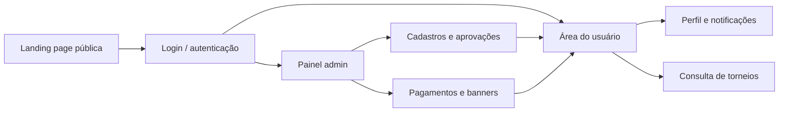
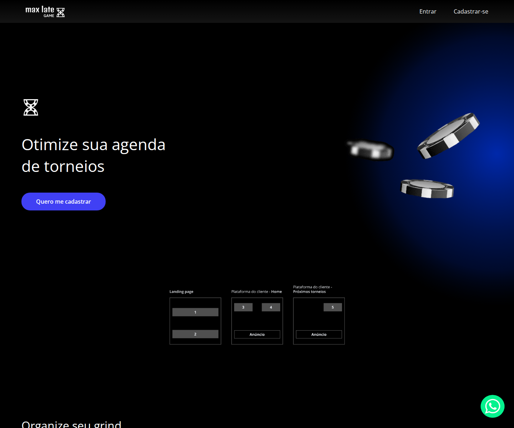
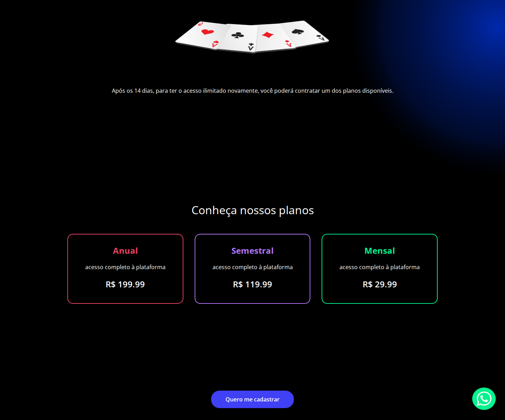
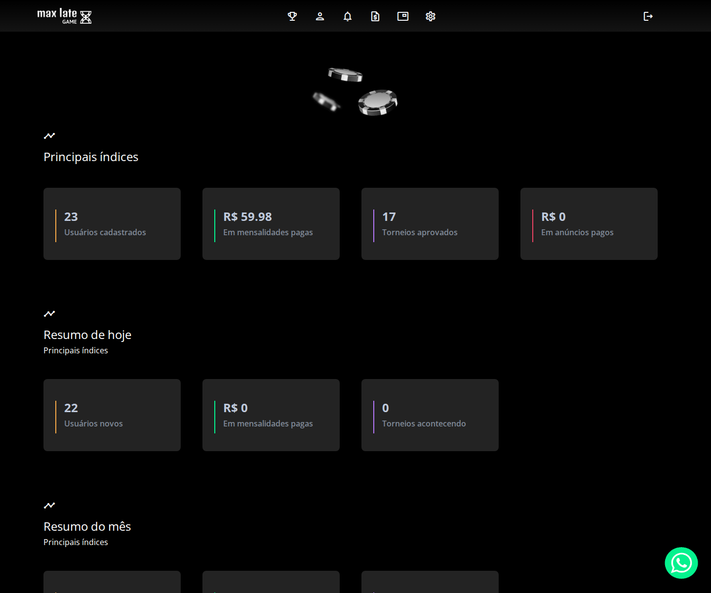
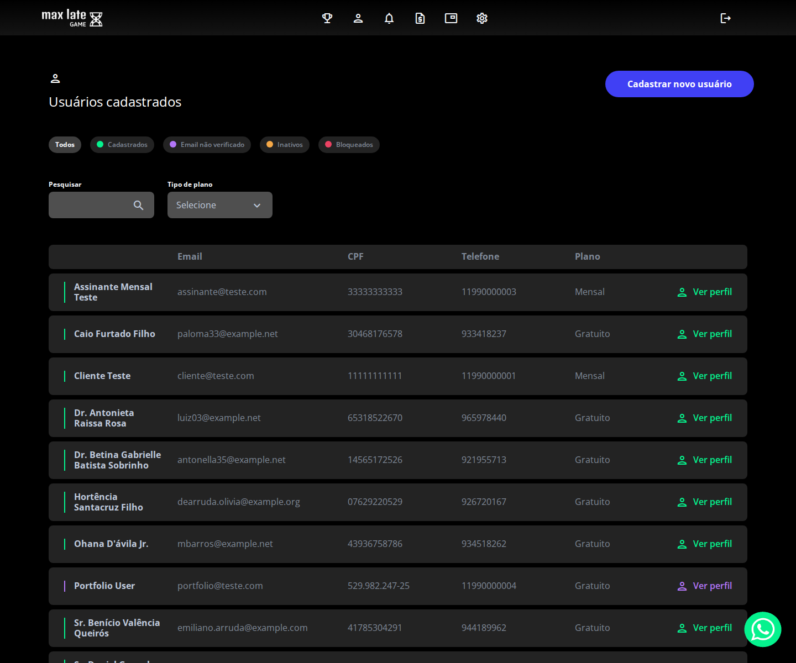
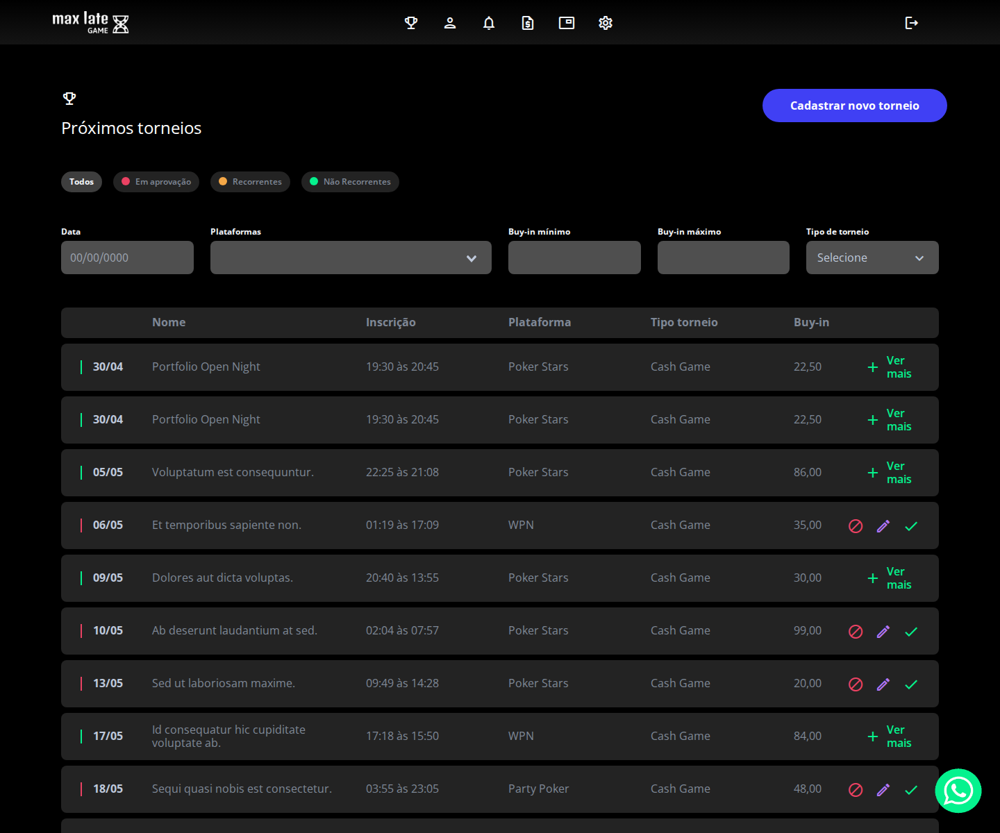
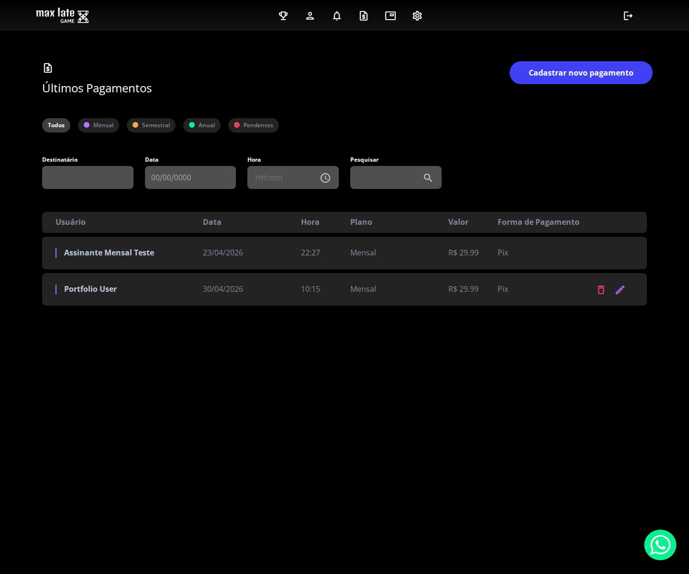
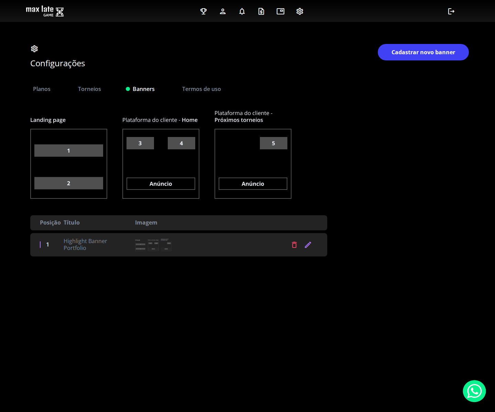
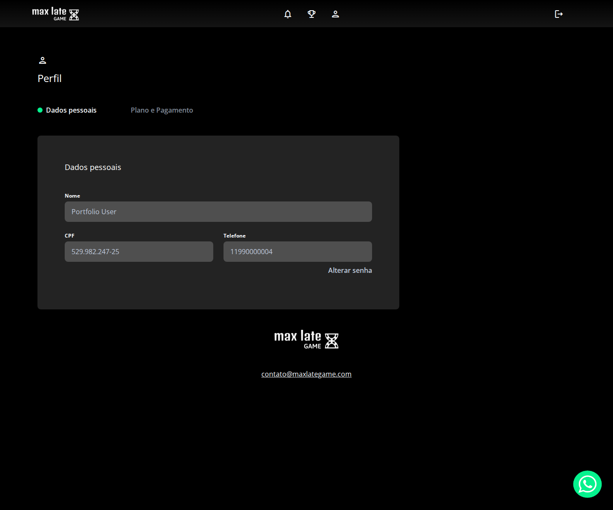
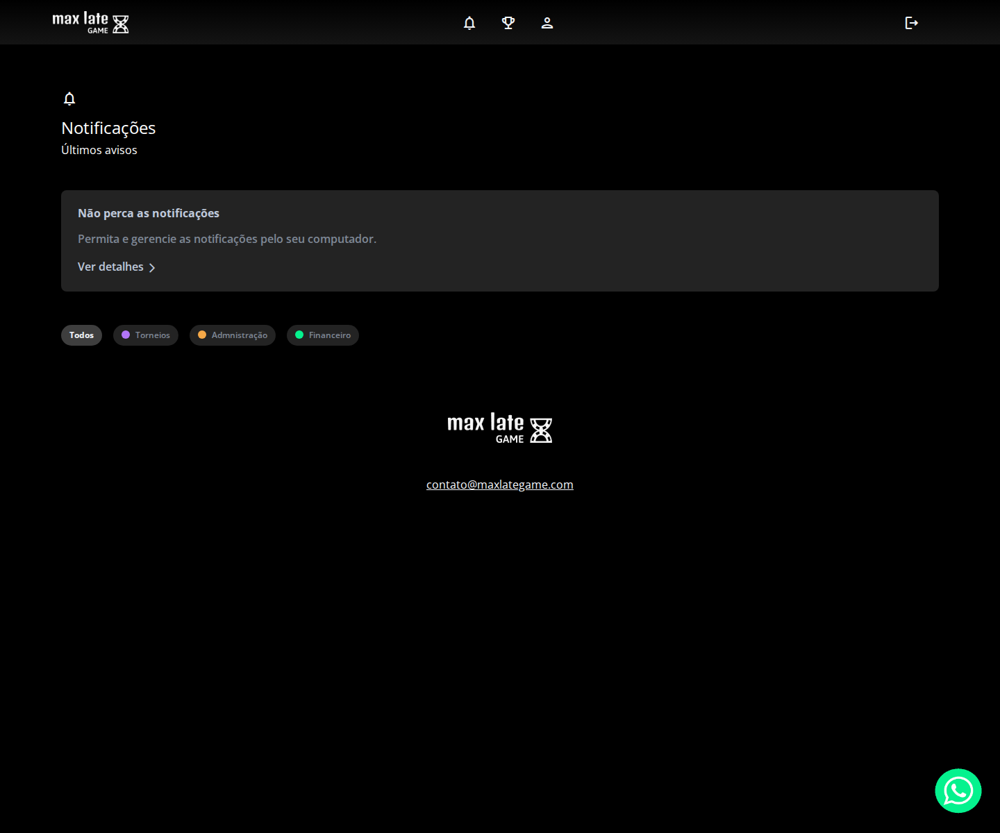

# Max Late Game

Plataforma para gestão de torneios, notificações e operação de assinaturas voltada ao universo de poker. O foco deste README é funcionar também como material de portfólio: explicar o produto com clareza, mostrar os principais fluxos e deixar registrado o resultado visual da aplicação. ✨

## Visão Geral

O projeto oferece uma experiência em três camadas:

- Público, com landing page, planos e entrada para a plataforma.
- Admin, com gestão de usuários, torneios, pagamentos, anúncios e configurações.
- Usuário, com acesso ao painel, perfil, torneios e notificações.

Para esta documentação, a base foi semeada com dados reais de demonstração, incluindo:

- `Portfolio User`
- `Portfolio Open Night`
- `Highlight Banner Portfolio`
- um pagamento manual para o fluxo financeiro
- notificações para o usuário de portfólio

## Tecnologias

- Laravel
- Vue 3
- Vue Router
- Pinia
- Bootstrap
- Playwright para captura dos screenshots desta documentação

## Fluxo da Experiência



## Execução Local

```bash
php artisan storage:link
php artisan key:generate
php artisan serve --host=127.0.0.1 --port=8000
```

## Credenciais de Demonstração

Use estas contas para navegar pelos fluxos documentados aqui:

- Admin: `admin@teste.com` / `password`
- Usuário de portfólio: `portfolio@teste.com` / `password`

## Capturas de Tela

Todas as imagens abaixo foram salvas em `doc/screenshots` com viewport consistente de `1440 x 1200`.

### Público

Landing page com o posicionamento da plataforma e acesso rápido aos planos.



Visão dos planos disponíveis, útil para comunicar o modelo comercial da plataforma.



### Admin

Painel principal com métricas operacionais e visão geral da operação.



Lista de usuários cadastrados com o usuário de portfólio em evidência.



Gestão de torneios com o torneio `Portfolio Open Night` aprovado.



Fluxo financeiro com o pagamento manual registrado para a conta de demonstração.



Área de configurações com o banner criado para reforçar a comunicação visual da plataforma.



### Usuário

Perfil do usuário de demonstração, útil para mostrar a experiência individual pós-login.



Centro de notificações com os eventos semeados durante a documentação.



## Observações de Portfólio

- A documentação foi pensada para deixar a navegação clara em poucos segundos.
- Os screenshots priorizam estados reais da aplicação, não mockups.
- A base de teste foi enriquecida durante a captura para mostrar melhor os fluxos críticos.
- O resultado final equilibra operação, produto e apresentação visual sem exageros.