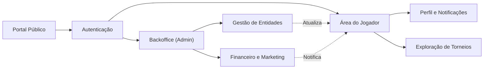

# Max Late Game

Plataforma profissional para gestão de torneios, controle de pagamentos e operação de assinaturas. O sistema oferece uma solução completa para organizadores e jogadores, automatizando processos desde a divulgação do evento até o gerenciamento de inscrições e notificações.

## Visão Geral

O projeto é dividido em três módulos principais que garantem a gestão ponta a ponta da operação:

- **Portal Público:** Landing page institucional, exibição de planos de assinatura e acesso à plataforma.
- **Painel Administrativo (Backoffice):** Gestão centralizada de usuários, aprovação de torneios, controle financeiro, gerenciamento de anúncios (banners) e configurações gerais.
- **Área do Jogador:** Acesso seguro ao painel individual, perfil, acompanhamento de torneios e central de notificações.

Para fins de demonstração, a base de dados inclui registros de exemplo, contemplando fluxos completos de pagamentos, torneios ativos e notificações.

## Tecnologias Utilizadas

- **Backend:** Laravel (PHP 8+)
- **Frontend:** Vue 3 (SPA), Vue Router, Pinia
- **Estilização:** Bootstrap / SASS
- **Ferramentas Adicionais:** MySQL, Playwright (Capturas E2E), PHPUnit

## Arquitetura de Fluxos



## Setup Local

```bash
# Clone e instalação
composer install
npm install

# Configuração de ambiente e banco
cp .env.example .env
php artisan key:generate
php artisan migrate --seed
php artisan storage:link

# Execução
npm run dev
php artisan serve --host=127.0.0.1 --port=8000
```

## Acesso aos Ambientes de Demonstração

Para navegar pelos módulos, utilize as contas iniciais de exemplo:

- **Administrador:** `admin@teste.com` / `password`
- **Jogador (Usuário Comum):** `portfolio@teste.com` / `password`

## Capturas de Tela (Showcase)

As telas abaixo ilustram o funcionamento da aplicação, refletindo os fluxos de ponta a ponta.

### Experiência Pública

Landing page com o posicionamento da plataforma, captação de leads e acesso rápido aos planos.


Apresentação dos planos de assinatura.


### Painel Administrativo

Dashboard de acompanhamento com métricas operacionais e indicadores gerais.


Gestão de usuários da plataforma e controle de status.


Central de torneios: listagem, aprovação e categorização de competições.


Painel financeiro para conciliação das movimentações de usuários.


Gestor de publicidade e marketing (banners) para veiculação segmentada na plataforma.


### Área do Jogador

Gestão individual, atualização de credenciais e segurança da conta.


Feed estruturado de notificações com atualizações de fluxo.


